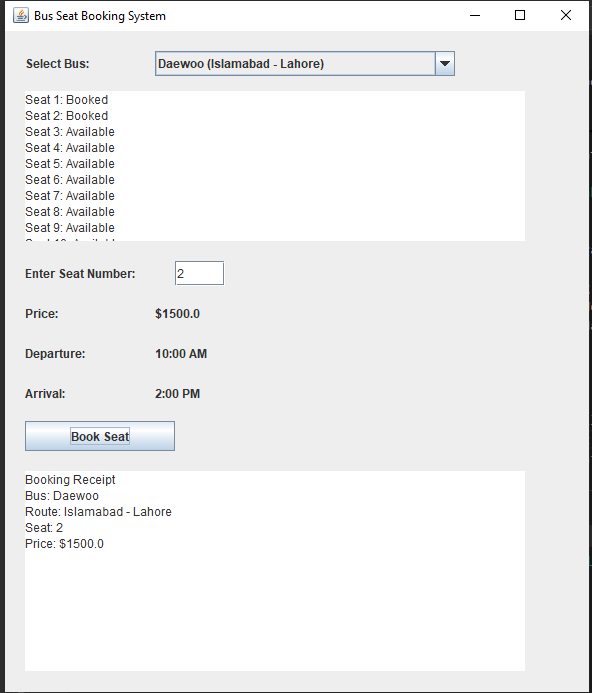

# Bus Seat Booking System

A **Bus Seat Booking System** implemented in Java using **Swing** for the GUI, allowing users to:
- View available buses
- Select a bus, view seat availability, and book seats
- Automatically move to the next available bus if a seat is unavailable
- View booking confirmations and receipts

## Features

- **Check Available Buses**: Users can view a list of available buses with route, price, and seat availability.
- **Seat Selection**: Users can select a specific seat and check if it is available.
- **Booking Confirmation**: Once the seat is selected, the user can confirm the booking.
- **Automatic Next Bus**: If the selected seat is unavailable, the system offers the user a chance to book the next available bus with the same seat number.
- **Receipt Generation**: After booking, a receipt is generated, showing the bus name, route, seat number, and price.
- **Larger GUI**: The system features a user-friendly GUI built with **Java Swing**.

## System Overview

This project contains the following core components:

1. **Bus.java**: Represents a bus, encapsulating attributes such as the bus name, route, price, seat availability, and arrival/departure times. This class follows the Information Expert principle by managing all relevant information and operations related to the bus, including checking seat availability and handling seat bookings.

2. **Seat.java**:  Represents individual seats on a bus, including the seat number and availability status. This class demonstrates Low Coupling by being independent of other classes and focusing solely on seat-related data and operations. It encapsulates seat availability logic while maintaining high cohesion by ensuring that all methods and properties directly relate to the seat's functionality.

3. **Booking.java**:Represents a booking made by a user, storing information about the bus, seat number, and price. This class adheres to the Creator principle, as it is responsible for instantiating the booking based on the provided bus and seat details. It manages all relevant booking details and ensures that the receipt generation is cohesive and directly related to the booking process.

4. **BusScheduler.java**: Handles the logic of finding the next available bus if the selected bus has no available seats. This class applies the High Cohesion principle by focusing solely on scheduling logic, allowing for efficient management of bus availability. It interacts with the bus data and seat availability without being tightly coupled to other components, thus promoting easier maintenance and testing.

5. **BusBookingApp.java**: The main application class, which creates the GUI for booking bus seats and manages interactions between the user and the bus system. This class follows the **Controller** principle as it coordinates all user actions, manages the flow of information between the GUI and backend logic, and controls the interaction between buses, seats, and the booking process.
## Architecture
The Bus Booking System follows a layered architecture, divided into the following packages:

- **Application Layer**: Contains `BusScheduler.java` for scheduling and managing bus bookings.
- **Domain Layer**: Includes `Bus.java`, `Seat.java`, and `Booking.java`, representing core entities and business logic.
- **Infrastructure Layer**: Contains `BookingService.java`, which handles data interactions (optional).
- **UI Layer**: Consists of `BusBookingApp.java`, the user interface for the application.

### Extensions
- **Invalid Details**: System prompts for correction if invalid input is detected.
- **Payment Error**: System handles payment failures with options to retry or cancel.
- **No Seats Available**: System suggests alternatives if no seats are available.

## Video of Documemt ( Daigram )
https://github.com/user-attachments/assets/913c094a-d14a-45de-8b7c-41f94bc9dc7c
## OUT PUT VIDEO Of Code:
https://github.com/user-attachments/assets/8d5af255-1b17-4c32-a740-6cebb78f9a12

## Screenshots



## Technologies Used

- **Java**: The main programming language used for this project.
- **Swing**: Used for creating the GUI components (JFrame, JTextArea, JComboBox, etc.).
- **Collections Framework**: For managing lists of buses, seats, and bookings.

## How to Run the Project

### Prerequisites

Make sure you have the following installed:
- Java Development Kit (JDK) version 8 or higher
- A Java IDE (e.g., IntelliJ IDEA, Eclipse) or terminal for running Java files

### Installation

1. **Clone the repository**:
   ```bash
   git clone https://github.com/yourusername/bus-seat-booking-system.git
   cd bus-seat-booking-system
   ```
   
